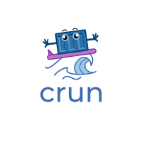
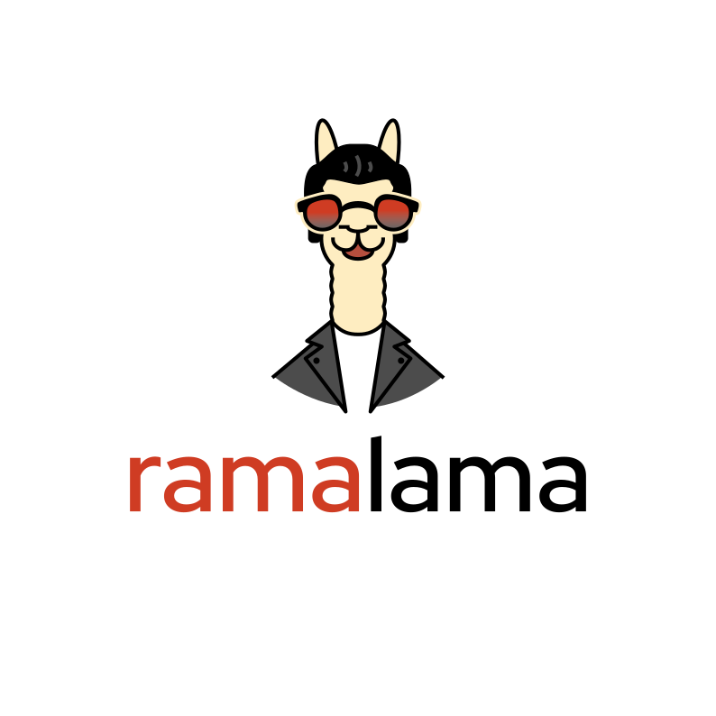
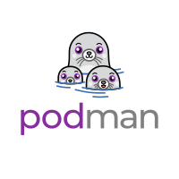
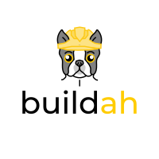
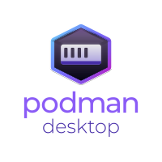
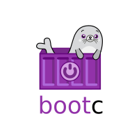
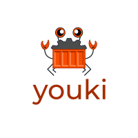

<a href="Containers">

</a>

# Welcome to Containers! 
We're a collection of open source tools that create, configure, and work with containers.

## 🛠️ Tools
- [**crun**](https://github.com/containers/crun) - A fast and lightweight fully featured OCI runtime and C library for running containers
- [**RamaLama**](https://github.com/containers/ramalama) - Simplifies local serving of AI models from any source and facilitates their use for inference in production through containers
- [**netavark**](https://github.com/containers/netavark) - Container network stack
- [**podman-compose**](https://github.com/containers/podman-compose) - A script to run docker-compose.yml using podman
- [**toolbox**](https://github.com/containers/toolbox) - Tool for interactive command line environments on Linux
- [**conmon**](https://github.com/containers/conmon) - An OCI container runtime monitor
- [**conmon-rs**](https://github.com/containers/conmon-rs) - A Rust-based OCI container runtime monitor

##

  
  

## 🛫 Related Repositories Living Elsewhere

  
  
  
  
  
  

## 🤝 Community
We have an active community. Most of our community communication channels are around [Podman](https://github.com/containers/podman), but we definitely welcome anyone with an interest in containers or any of our tools.

Maintainers of Containers and other community members generally chat here:
- IRC: #podman on [libera.chat](https://libera.chat/)
- Matrix: [#podman:fedoraproject.org](https://matrix.to/#/#podman:fedoraproject.org)
- Discord: [Podman](https://discord.com/invite/x5GzFF6QH4)

Note: The Matrix room has been bridged with the Discord server

We also hold [community meetings](https://podman.io/community/#community-meetings) around once a month and have a [mailing list](https://podman.io/community/#mailing-list) for additional discussion.

Follow us on Twitter! [@podman_io](https://x.com/podman_io) [@buildah_io](https://x.com/buildah_io)

## 👩‍💻 Contributing
We welcome and encourage contributions, including issues, discussions, and PR's. Please make sure to read our [Contributing Guidelines](https://github.com/containers/container-libs/blob/main/CONTRIBUTING.md) and our [Code of Conduct](https://github.com/containers/container-libs/blob/main/CODE-OF-CONDUCT.md) before doing so.

## 🔐 Security
Found a security issue? Most projects follow our [Security and Disclosure Policy](https://github.com/containers/container-libs/blob/main/SECURITY.md), but a few may have further instructions, so please check the specific project's SECURITY.md in their top-level repository on how to proceed.
