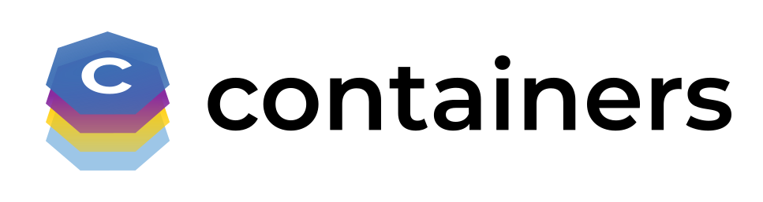

<a href="Containers">

</a>

# Welcome to Containers! 
We're a collection of open source tools that create, configure, and work with containers.

## 🛠️ Tools
Some of our tools include [Podman](https://github.com/containers/podman), [Buildah](https://github.com/containers/buildah), [Skopeo](https://github.com/containers/skopeo), [conmon-rs](https://github.com/containers/conmon-rs), [crun](https://github.com/containers/crun), [Podman Desktop](https://github.com/containers/podman-desktop), [youki](https://github.com/containers/youki) and [RamaLama](https://github.com/containers/ramalama) as well as our supporting libraries common, storage, image in the [container-libs](https://github.com/containers/container-libs) repo. Check them out and see all the cool things happening!

##

   
  
  
  
    
  
  
  

## 🤝 Community
We have an active community. Most of our community communication channels are around [Podman](https://github.com/containers/podman), but we definitely welcome anyone with an interest in containers or any of our tools.

Maintainers of Containers and other community members generally chat here:
- IRC: #podman on [libera.chat](https://libera.chat/)
- Matrix: [#podman:fedoraproject.org](https://matrix.to/#/#podman:fedoraproject.org)
- Discord: [Podman](https://discord.com/invite/x5GzFF6QH4)

Note: The Matrix room has been bridged with the Discord server

We also hold [community meetings](https://podman.io/community/#community-meetings) around once a month and have a [mailing list](https://podman.io/community/#mailing-list) for additional discussion.

Follow us on Twitter! [@podman_io](https://x.com/podman_io) [@buildah_io](https://x.com/buildah_io)

## 👩‍💻 Contributing
We welcome and encourage contributions, including issues, discussions, and PR's. Please make sure to read our [Contributing Guidelines](https://github.com/containers/container-libs/blob/main/CONTRIBUTING.md) and our [Code of Conduct](https://github.com/containers/container-libs/blob/main/CODE-OF-CONDUCT.md) before doing so.

## 🔐 Security
Found a security issue? Most projects follow our [Security and Disclosure Policy](https://github.com/containers/container-libs/blob/main/SECURITY.md), but a few may have further instructions, so please check the specific project's SECURITY.md in their top-level repository on how to proceed.
